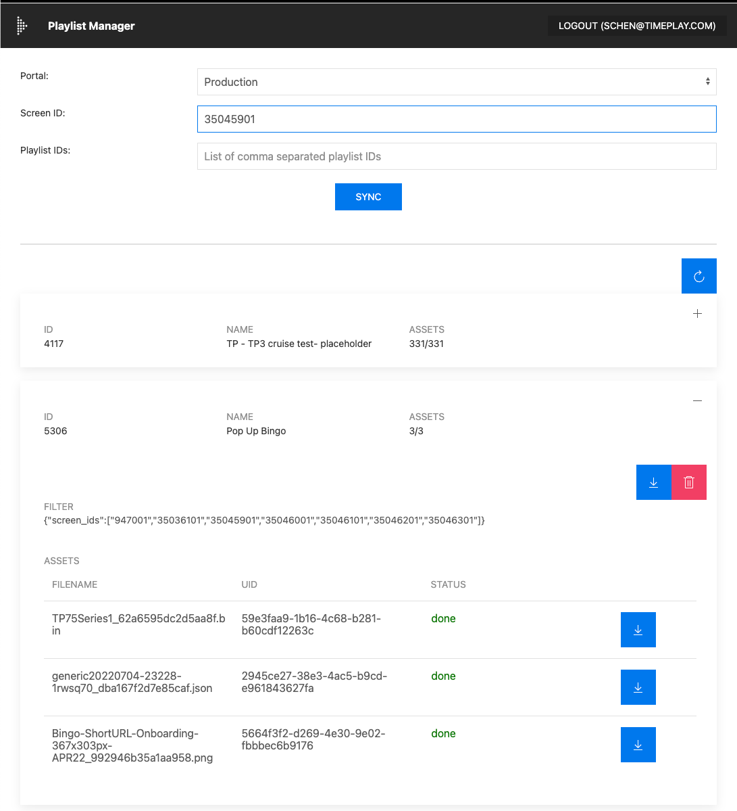
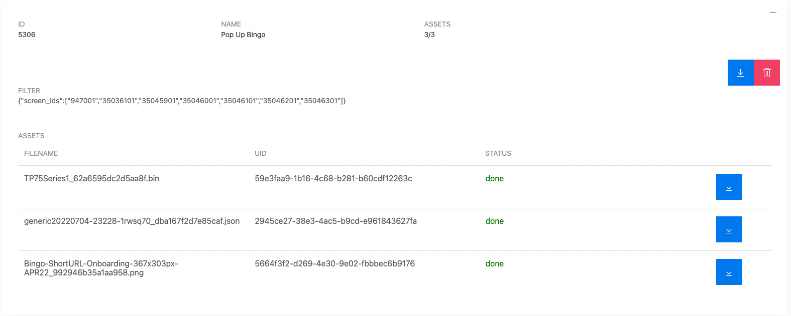
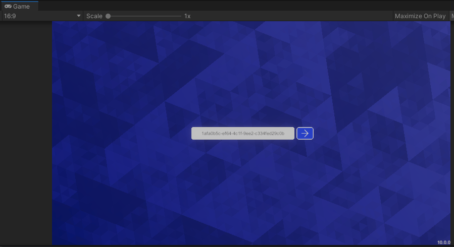
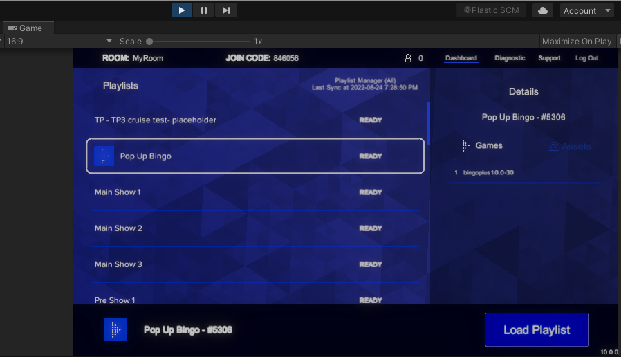

# Developer Setup Guide

------------
## Setup docker stack
This guide is meant to setup the stack on a developer's local environment. The configuration is simplified to make development easier. The deployment configuration differs in several components.

You may see some of the following components running in your local stack but they're not used in this guide. Instead, the developer's local environment points to remote so that developers don't need to configure these:
```
Auth server (keycloak)
gs-package-service
gs-host-process
```
Check the gameserver3 config lower in this doc and compare to the config you intend to and decide if you are using local or remote services for these. This tutorial has package server host set to a remote one (staging) so that one doesn't need to be configured in the stack. The host process we can forget about if we don't use a build and instead run GS in the unity editor like we will in this tutorial. The access_token we get later when creating a license comes from stg-auth.timeplay.com which is remote so we don't need to configure the local one.

### Install docker desktop
Download and install from https://www.docker.com/products/docker-desktop/
For instructions on Linux (WSL) follow the guide [wsl-guide](./wsl-setup.md)

### Install jq
Download and install jq from https://jqlang.github.io/jq/download/

### Configure the stack
Go to tp3-docker-stack

First copy the contents of `overrides.example.env` to `overrides.env`.

Edit the contents of `overrides.env` with your desired configurations.  For the most part, you should only need to set the `STACK_PARTNER` variable, which refers to the vendor you want your stack to be configured for. See the `partner` folder for all of the avilable options

The example overrides has set all the `STACK_COMPONENTS` required for local development, each value here should correspond to a folder in the `components` folder.

Replace value of HOST_IP with your machine's IP address on the local network.
For example:
```
HOST_IP=192.168.86.107
```
Do not use `127.0.0.1`. You can use your public internet IP address but this requires having router setup properly so connection coming from the internet can reach your machine.

In the event of using WSL, run the command `ip addr show eth0` in the linux terminal to get the IP address for WSL. If using Docker Desktop, you can run ipconfig on terminal or powershell to get the appropriate address.

### Startup the stack
Run the script `run.sh` with the options `start`, `stop` or `down`

`start` will then pull all the required docker images and start up the stack.
`stop` will stop the stack.
`down` will remove the stack.

Once stack is running, run the script `effective.init.sh`. Alternatively, run the individual commands based on the configurations found in the partners folder.

Example for celebrity:
```
#!/bin/bash

# Initializing SKUs
docker exec -i web-client-service sh -c "npm run setup ./scripts/bingo-sku.json"
docker exec -i web-client-service sh -c "npm run setup ./scripts/trivia-sku.json"

# Initializing rewards
docker exec -i reward-service sh -c "npm run setup ./scripts/bingo-reward.json"
docker exec -i reward-service sh -c "npm run setup ./scripts/trivia-reward.json"
```

### Host file
Modify host file on your machine

Windows: C:\Windows\System32\drivers\etc\hosts

MacOS: /etc/hosts

Add this entry to the host file, use the same IP address from HOST_IP above:
```
192.168.86.107 local.timeplay.me
```

Note: the domain needs to match whatever domain is specified in your overrides `HOST_NAME`, in developer stacks, to keep things simple, everyone should just use local.timeplay.me

### Verify stack
Start the stack and expect 18 containers to be created and started.

Open Chrome browser, verify you can login to the following pages, use the creditials admin/admin as username and password.
```
    https://timeplay.me/frontend/user-dashboard (User Dashboard)
    https://timeplay.me/frontend/bingo-opcon (OpCon)
    https://timeplay.me/frontend/admin-service (Admin Service)
    https://timeplay.me/frontend/playlist-manager (Playlist Manager)
```

If you get SSL warnings, type in `thisisunsafe` anywhere on the window and the browser will let you visit the page.

If you get a `missing-config` error during loging check that the `timeplay.crt` and `timeplay.key` files are added properly.

You can turn back on the warning anytime by going to the site info icon on the left side of the address bar.

Use your timeplay account credential to login to opcon, playlist manager, or admin service. User dashboard is setup to use mock guest users and has no credential.

### Sync content
There are two ways to sync content, through Timeplay content management server (Tools) or through a zip package.

#### Tools
If you have a timeplay account with admin access and you know what screen to sync...

Go to Playlist Manager https://timeplay.me/frontend/playlist-manager

Select
```
Portal: Production
Screen ID: 35045901
```
Click on `Sync` button



Wait for playlist to be downloaded from Timeplay's content management server (Tools) to your local stack.

You can verify status of assets being downloaded by expanding on a playlist. Circle arrow button refresh the asset count.

For screen with a lot of playlists, it can take a while to finish the sync.

If after a while, there are assets in error state, you can repeat the above steps to resume the sync.
Once synced you can visit the OpCon at `https://timeplay.me/frontend/bingo-opcon` to start a session. Find the playlist that has been synced and start the session when prompted. Take note
of the session id; this will be used later step with the gameserver.

#### Load from package
Obtain a zip package of a playlist from an existing playlist manager. If you do not have access to an existing playlist manager, ask the Timeplay team for the zip package.

Click on the download icon to download the package.



Unzip the package next to tp3-docker-stack/docker-stack/init-playlist.sh

Run the script with playlist ID (ie. extracted folder name) as argument:

```
sh init-playlist.sh 5306
```

This script adds playlist and assets into your local stack's playlist and asset manager.

------------
## Setup GameServer
Unzip the gameserver package. This contains the Unity project source code of GameServer.

Open the gameserver folder with Unity Editor 2019.4.x

Open GameServer scene and enter Play Mode. This creates the persistent folder for GameServer. Exit Play Mode.

Run the following commands:
```
access_token=$(curl --location --request POST "https://stg-auth.timeplay.com/auth/realms/Timeplay/protocol/openid-connect/token" \
--header 'Content-Type: application/x-www-form-urlencoded' \
--data-urlencode "grant_type=client_credentials" \
--data-urlencode "client_id=dev" \
--data-urlencode "client_secret=ckI4ntE17Zc1u03jdklFkWeKOH4M60FM" | jq ".access_token" -r)

curl --request POST \
  --url https://timeplay.me/gls/license \
  --header "Authorization: Bearer $access_token" \
  --header 'Content-Type: application/json' \
  --data '{
    "key": "1afa0b5c-ef64-4c1f-9ee2-c334fed29c0b",
    "expiresAt": "2030-12-28T00:00:00.000Z",
    "configs": {}
}'
```
Go to the config folder under persistent folder. On windows C:\Users\<your username>\AppData\LocalLow\Timeplay\GameServer\config
(For more info, see https://docs.unity3d.com/2019.4/Documentation/ScriptReference/Application-persistentDataPath.html)

Create the following file in the config folder:

gameserver.config3.json
```
{
  "role": "gameserver",
  "client_id": "tp-dev",
  "client_secret": "bgPSlLsyLM62tqMqNGaHDhbqQr5I4I0h",
  "portalIp": "https://stg-tools.timeplay.com",
  "auth_token_uri": "https://stg-auth.timeplay.com/auth/realms/Timeplay/protocol/openid-connect/token",
  "serverAddress": "0.0.0.0",
  "roomServer": "https://timeplay.me/gr",
  "assetManagerHost": "https://timeplay.me/am",
  "playlistServer": "https://timeplay.me/pm",
  "packageServerHost": "https://ships-stg-ss.timeplay.com/gps",
  "licenseServerHost": "https://timeplay.me/gls",
  "sessionManager": "https://timeplay.me/sm"
}
```
Replace with the domain names `timeplay.me` or `timeplay.me` configured from the above steps.

Enter Play Mode again, enter this license at the prompt `1afa0b5c-ef64-4c1f-9ee2-c334fed29c0b` which is the one we sent when creating the license above. If using a different UUID when creating the license put that one here.


Be sure to enter the session id corresponding under the game manager.

GameServer then enters the dashboard screen, where it will download all the playlist/asset from the stack to GameServer's persistent folder. Since you're running the stack locally, this essentially copy files from one location to another on your machine.



Exit Play Mode once playlists downloads are complete.

------------
#### You have now completed setting up your local environment. See development-guide.md on how to setup your specific game, and how to apply changes in your game to run in your local stack.
