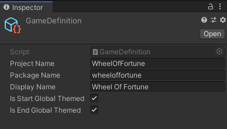
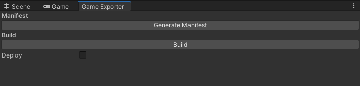
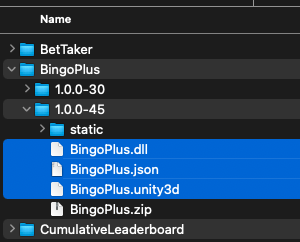
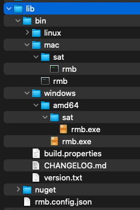

# Development Guide

This guide covers how game development works within your local environment.

------------
## Big screen Game
Clone the bigscreen git project. Open the project with Unity Editor 2019.4.x

#### Game Definition
Click on Assets/GameDefinition and view the asset in Inspector



`Project Name` is name of the game. Convension is Pascal Case. This should match to game's name in playlist.

`Package Name` is name of the game package. This should be same as `Project Name` but all lowercase.

`Display Name` is for display purpose. This should be the official name of the game.

#### Assembly Definition
Click on Assets/<Project Name>.asmdef and view the asset in Inspector

The `Name` field must match to the `Project Name`. This file wraps the entire project code (excluding editor code) in a single assembly under this name.

#### Game Scene
Locate the game's scene in the project. It should be under this path: Assets/Scenes/`Project Name`/`Project Name`.scene

The scene file must be under this path for Game Exporter to find it.

A limitation with Timeplay game is that the entire game must be run from a single scene. If your game is complex, use prefab to organize your gameobjects.

#### Building the game
Switch project's target platform to the platform of your development machine. Example, if you are running GameServer on Mac OS X, switch your game's project platform to Mac OS X.

From dropdown menu, open Timeplay/Game Exporter window.

Click on `Build` button to start the build process.



Check the Console window for any build error. Once build process completes, it generates the following artifacts:
```
GameContent/<platform>/<Project Name>.json
                       <Project Name>.dll
                       <Scene Name>.unity3d
```

If you switch to another platform and build again, another platform folder will be created.

The json file contains various settings for the game as well as info from `GameDefinition`.

Dll file contains the game's code. This is generated from the assembly definition from above.

unity3d file is an asset bundle created from the game's scene file.

#### Copy the game to Gameserver
Locate your game's folder in Gameserver's persistent folder: 
On windows C:\Users\<your username>\AppData\LocalLow\Timeplay\GameServer\GameServerContent\Games\<Project Name>\

There should already be a package of your game uploaded to the package service. If not, ask Timeplay team for assistance.

GameServer download the latest version from package service. Go to the latest version folder. Replace dll, json, and unity3d files from your build.



Do not delete the zip file. If this file is deleted, GameServer will download and extract from package service again and override your change.

#### Developing big screen game
It's best to build the big screen game by itself before integration testing because it can become a hassle to constantly build the game, copy to GameServer, and run it for each change in the game.

A debug control panel to simulate incoming network message is generally very helpful for developing the big screen game.

#### Event system
All of the game's communication with the network is through GameServer by using the `Messenger` class.

`Messenger` class is essentially a delegate manager for sending and listening events.

`EventNames.cs` defines all the events. Some are network message like the ones in RMB section. Some are local events between game and GameServer.

Send `EndGameSignal` when the game is completed. This is critical because GameServer does not know when a game ends. Without this message, the playlist will be stuck hanging. When GameServer receives this message, it advance playlist to the next game. If it's at the end of playlist, GameServer will either exit or return to dashboard.

See `NetworkEventManager.cs` for sample of handling RMB message. Generally, you can reuse this class as is and listen for incoming RMB message through this class.

------------
## Network Protocol
It's best to define your game's network protocols early because it's the communication guideline between bigscreen, actor, and controller.

Keep in mind that actor should be authoritative. For example, in the bingo game, big screen sends DropBall(1002) to actor. Actor generates the next ball, sends another message BallDropped(1001) to big screen.

The message's network ID is int. The message payload is generic object, but usually we use json string. The receiver should deserialize payload to the format defined in the protocol.

See `NetworkIDs.cs` for example of network message. Some message are built-in in RMB such as
```
LoadController = 100,
PlayerJoined = 102,
```

Use 4 digit number for your game's network IDs, such as 4xxx game A, 5xxx for game B. Coordinate with the Timeplay team to avoid network ID collision with other games.

------------
## Controller
Controller is html based javascript project. It is meant to run in web browser on player's mobile device.

Controller is loaded by web-client, similar to how games are loaded by GameServer.

Clone the controller git project. Open the project with any IDE such as Visual Studio Code.

#### Controller name

Controller name is defined in `package.json` under `name` field.

This name needs to match in serveral places in the project. Below example use `wheeloffortune` as the controller name:

package.json
```
{
  "name": "wheeloffortune",
}
```

gulpfile.js
```
var config = {
	source: {
		folder: 'src',
		entry: 'js/index.js'
	},
	build: {
		folder: 'build',
		mapDir: 'maps'
	},
	name: 'wheeloffortune'
}
```

src/wheeloffortune.html
```
<script src="games/wheeloffortune/wheeloffortune.js"></script>
```

Controller name is usually same as name of the game, but it does not need to be. As long as all bigscreen and actor works with the controller's RMB protocol, any controller can be used.

Bigscreen load the controller by sending RMB message LoadController (100)
```
LoadControllerData controllerInfo = new LoadControllerData()
{
    gameTemplate = controllerName,
    contentId = GameContent.Content.Id
};

var data = new Dictionary<int, object>();
data.Add((int)ControllerEventIDs.LoadController, controllerInfo);

// send to rmb so players joining later will autoload this controller
Messenger.Broadcast(EventNames.RMBSetLateJoinMsg, payload);

// Send Controller to Clients for players that already have web client running
Messenger.Broadcast(EventNames.RMBSendToClient, data, playerIDs);
```

#### Setup
Run the following to install all dependencies:
```
npm install
```

Run the following to build the controller:
```
npm run build
```

Artifact is created under <your-controller-project>/build folder.

#### Add the controller build to your stack
Go to tp3-docker-stack/docker-stack/docker-compose.dev.yml and uncomment the following code
```
services:
    proxy-server:
        volumes:
            # override controller in the stack with build from your local project
            - <your-controller-project>/build:/usr/share/nginx/frontend/web-client/games/<your-controller-name>
```
Replace <your-controller-project>/build with path of your controller build.

Replace <your-controller-name> with name of the controller.

Run run-ships-partial.sh again for the stack to use above configuration change.

This mapping allows the stack to reflect any changes in your build of the controller, without restart the stack or rebuilding any docker image.

#### General guideline
The provided example controller (based on pickthree) is rendered by phaser.

Controller cannot send RMB message to big screen directly. It must be sent to actor first. This is how the system to manage large number of players without overloading the big screen game.

------------
## Actor

Actor is the authoriative server for your game. It manage the game state, handles player request so big screen does not get overwhelm.

There is one mothership actor in each session. There is at least one satellite actor in a session. The docker stack allow up to 9 satellites to scale up as more players join the session.

In general, mothership handles core game state and bigscreen message. Mothership also sends game state to satellites. Satellite handles player message and take advantage of concurrent satellite process to do most of the work.

### Golang actor
Golang actor is built into the RMB executable. Creating a unique rmb artifact. The room-message-bus docker image contains golang actor for trivia games such as pickthree, quiz it.

### CSharp actor
CSharp actor is a standalone executable. RMB spawns the csharp actor process when its game starts in the playlist. CSharp actor communicates with RMB through local network using the RMB network protocol.

Open the actor's solution file in Visual Studio.

The csharp solution has the following projects:
```
actor - spawns RMB process and connects the actor to RMB. This is used to debug the actor in visual studio.
controller - the main loop of the actor's process
model - any data structure shared by mothership and satellite actor
mothership - the mothership actor
ms_standalone - project to build mothership actor executable
satellite - the satellite actor
sat_standalone - project to build satellite actor executable
```

#### Add nuget repository

In Visual Studio, open NuGet Package Source manager, and add a new source:
The location is `https://ships-repo.timeplay.com/repository/nuget-snapshot-local`
Use your Nexus credential as login.

#### Add rmb executable
Extract room-message-bus package to under lib/bin/

Make sure the executable has permission to run on your machine. On macos for example, you would need to go into Security&Privacy panel to allow the app to run.

Copy the exe to a sub folder named /sat. The complete structure is as follows:



Make sure the code in `actor` project that spawn the rmb process match to the directory structure:
```
var osVersion = Environment.OSVersion;
if (osVersion.Platform == PlatformID.Win32NT || osVersion.Platform == PlatformID.Win32Windows ||
    osVersion.Platform == PlatformID.Xbox)
{
    path = $"lib/bin/windows/amd64/rmb.exe";
}
else
if (osVersion.Platform == PlatformID.Unix)
{
    //always return mac for now
    path = $"lib/bin/mac/rmb";
}
```

As well as the process argument which points to lib/rmb.config.json
```
process.StartInfo.Arguments = "-cfg ../../rmb.config.json";
```

You can run the `actor` project in Visual Studio to verify it starts up correctly:
```
2022-08-29 17:29:53,545 INFO actor.Showdown - Args =
2022-08-29 17:29:53,744 INFO actor.Showdown - [StreamSIX.EntityClient constructor]
2022-08-29 17:29:53,776 INFO actor.Showdown - [StreamSIX.LeaderboardClient constructor]
2022-08-29 17:29:54,011 INFO actor.Showdown - Waiting for RMB to connect
2022-08-29 17:29:54,461 INFO actor.Showdown - New RMB connected.
2022-08-29 17:29:54,468 INFO actor.Showdown - Waiting for RMB to connect
2022-08-29 17:29:54,478 INFO actor.Showdown - Spawner received raw message: {"init":true}
2022-08-29 17:29:54,584 INFO actor.Showdown - New RMB connected.
2022-08-29 17:29:54,587 INFO actor.Showdown - Waiting for RMB to connect
2022-08-29 17:29:54,589 INFO actor.Showdown - Spawner received raw message: {"init":true}
2022-08-29 17:29:54,830 INFO actor.Showdown - Received init request
2022-08-29 17:29:54,830 INFO actor.Showdown - Received init request
2022-08-29 17:29:55,192 INFO actor.Showdown - Initialized rmb with {"pid":61640,"games":{"showdown":true}}
2022-08-29 17:29:55,192 INFO actor.Showdown - Initialized rmb with {"pid":61640,"games":{"showdown":true}}
```

#### Building csharp actor
Go to Dockerfile and replace the output file and name of game in the following lines. 
```
COPY ./ms_standalone/bin/Release/net5.0/linux-x64/publish/<mothership output file> ./<name of actor>/mothership
COPY ./sat_standalone/bin/Release/net5.0/linux-x64/publish/<satellite output file> ./<name of actor>/satellite
```

The mothership/satellite output filename is the PackageId found in ms_standalone.csproj and sat_standalone.csproj
For example:
```
Timeplay.WheelOfFortune.Actor.Mothership
Timeplay.WheelOfFortune.Actor.Satellite
```

Name of actor is name of game in lowercase, for example:
```
wheeloffortune
pickthreeplus
etc
```

It match to the string when big screen sets RMB's custom target:
```
Messenger.Broadcast(EventNames.RMBSetCustomTarget, "wheeloffortune", mCustomTargetPeerType);
```

Run this script to create/update a local docker image named `room-message-bus:local`
```
sh build-image.sh
```

#### Override rmb image in the stack
Go to tp3-docker-stack/docker-stack/.env

Replace this line
```
RMB_IMAGE=registry.timeplay.com/docker-virtual/room-message-bus:1.6.0-37
```
with
```
RMB_IMAGE=room-message-bus:local
```

Run `run-ships-partial.sh` to update the stack. Any new rmb spawn will now use the docker image built in previous step.

------------
#### This completes setting up your game on bigscree/controller/actor. See development-test.md on how to run and debug your game.
