# Development Testing

This guide walkthrough running a playlist end-to-end from bigscreen, actor to controller.

This guide assumes the stack is configured for ships which starts the session through opcon. We also assume the stack is configured with `mock-guest` so player can login with just a nickname. Integration with ship's API will require login using account provided by ship's service.

------------
## Starting a session

Login to Opcon using your timeplay account at: https://timeplay.me/frontend/bingo-opcon

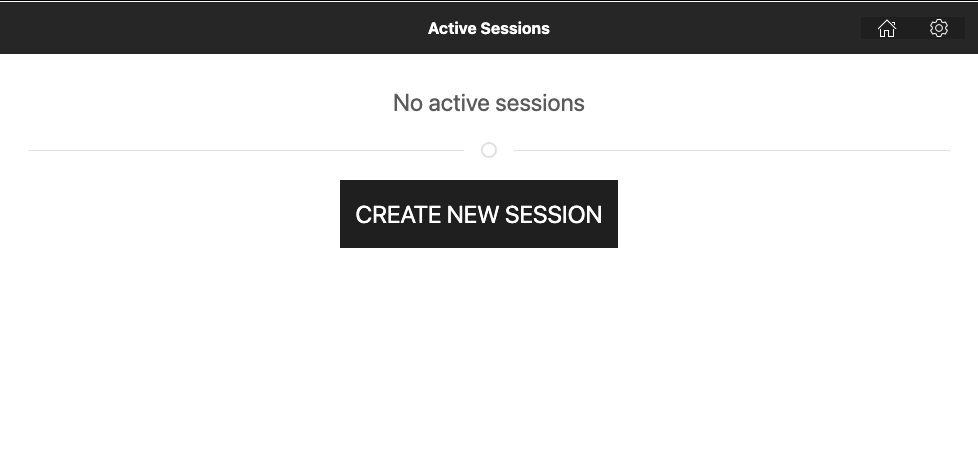

Select a category. Each cateogry match to a screen ID. Playlists are grouped by screen ID.

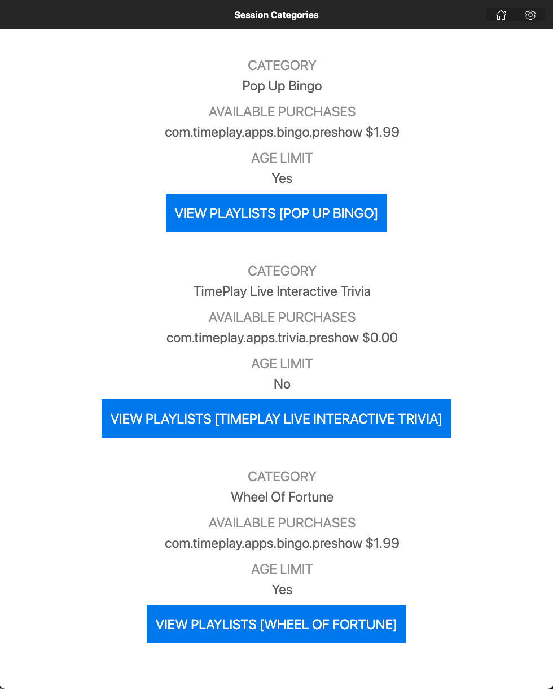

Select a playlist to run.

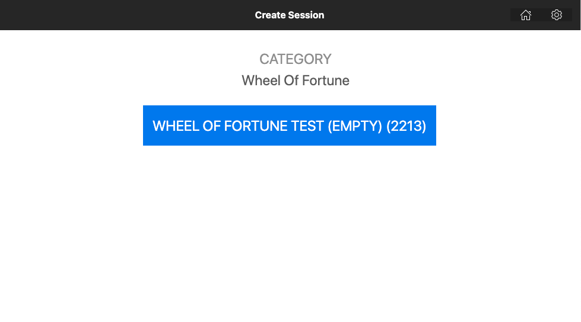

You will encounter this error in session lobby as opcon try to trigger gameserver to launch. This requires `gs-host-process` to be installed which we ommitted in this guide. It's also not possible to start gameserver in Unity Editor this way so we have to do this manually. In the meantime, opcon is constantly trying to connect to RMB which has not been spawn yet.

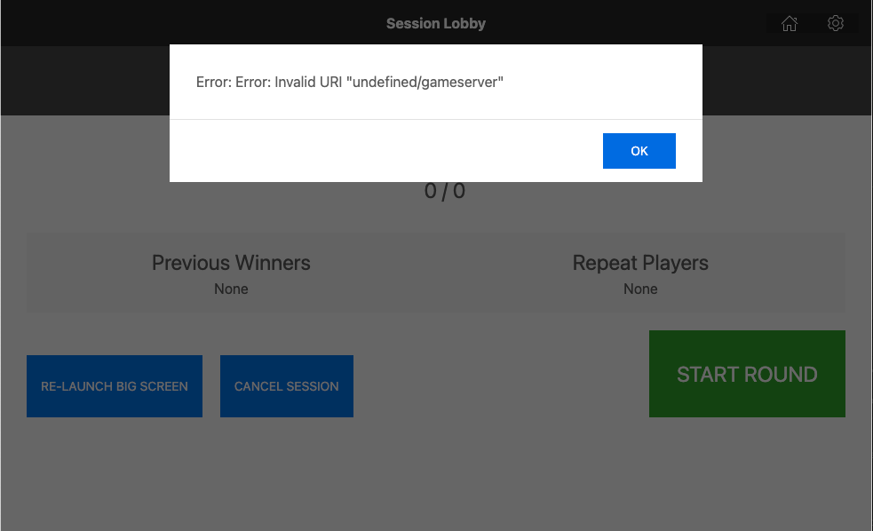

Copy the session ID highlighted below and paste to gameserver.

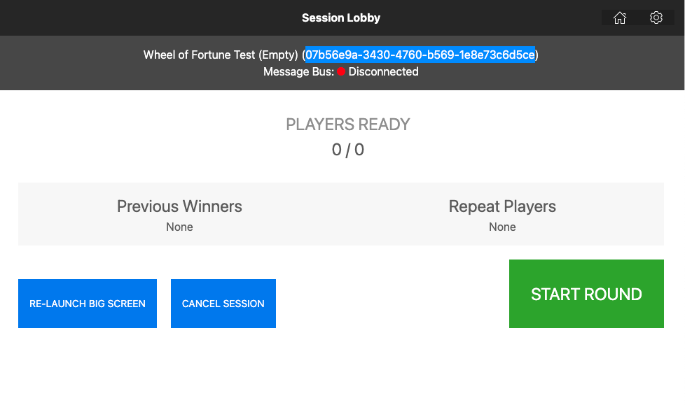

In GameServer Unity project, open GameServer scene and select Session gameobject. Paste the session ID to `GameManager` behaviour's `M Session Id` field. Then enter Play Mode.

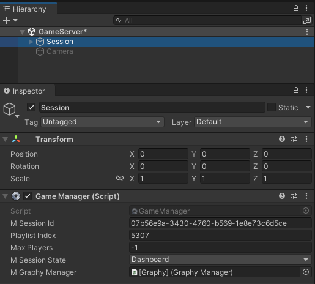

Starting GameServer triggers spawning of RMB. You can verify RMB tasks have spawn in Docker Desktop. A new session always start with one mothership and one satellite RMB.

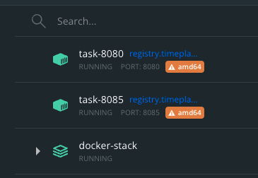

After a while, gameserver should be connected to RMB.
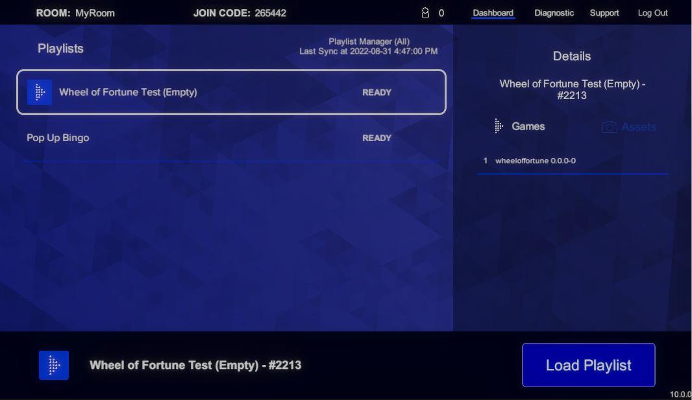

Opcon should be conected as well.
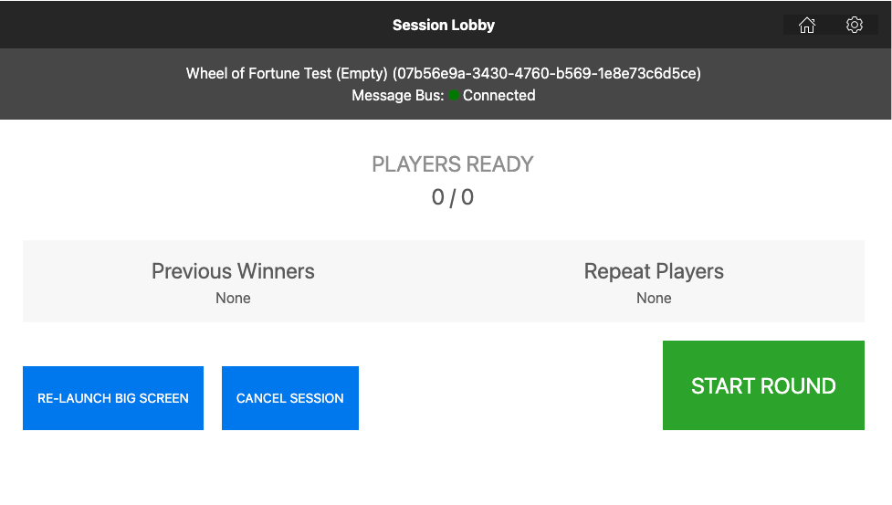

------------
## Player joining session

Open Chrome browser and go to https://timeplay.me. This only works on the machine where the stack is running because we modify the host file on this machine to map timeplay.me to its IP. You can have mobile device join through local network by modify host file on a mobile device but this is outside scope of this guide.

Player login screen only appears when a session is created and RMB are running.

Enter any nickname to login.

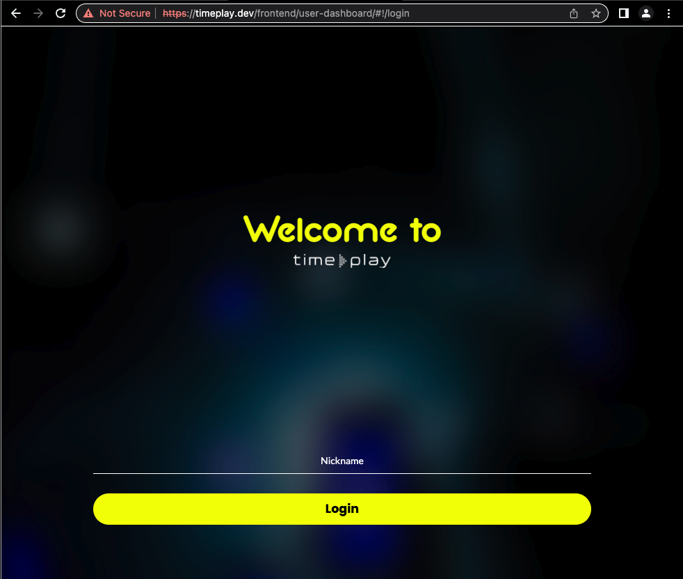

Select a session to join. This match to the session that's started by opcon. Stack configured with `mock-guest` will bypass any purchase processing with ship's API.

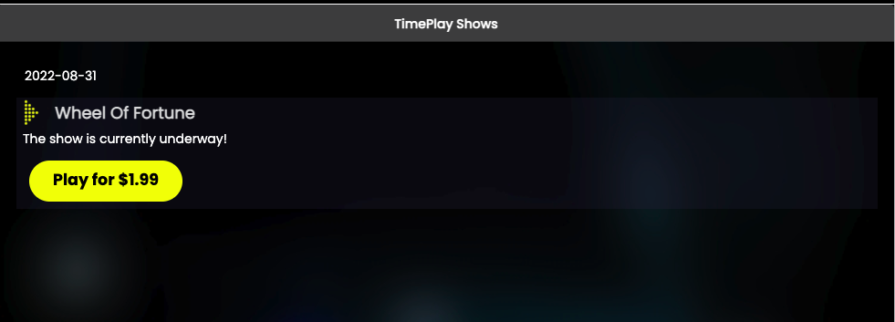

Player is redirect to web-client. This screen is a waiting room before any playlist has started. If player join while playlist is already running, player will be redirect to the current running game's controller.

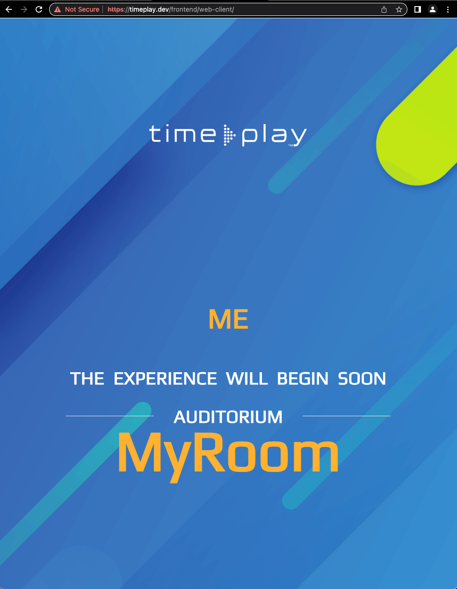

------------
## Starting a playlist

In production environment, GameServer runs in direct mode which runs the playlist specified in opcon.

In Unity Editor, GameServer runs in dashboard mode by default which allows you to select a playlist. This means you can start a playlist that's different from what was selected in opcon. The session should still run correctly but may generate inconsistency in reports.

Select a playlist, click on `Load Playlist`, then click on `Start Playlist`.

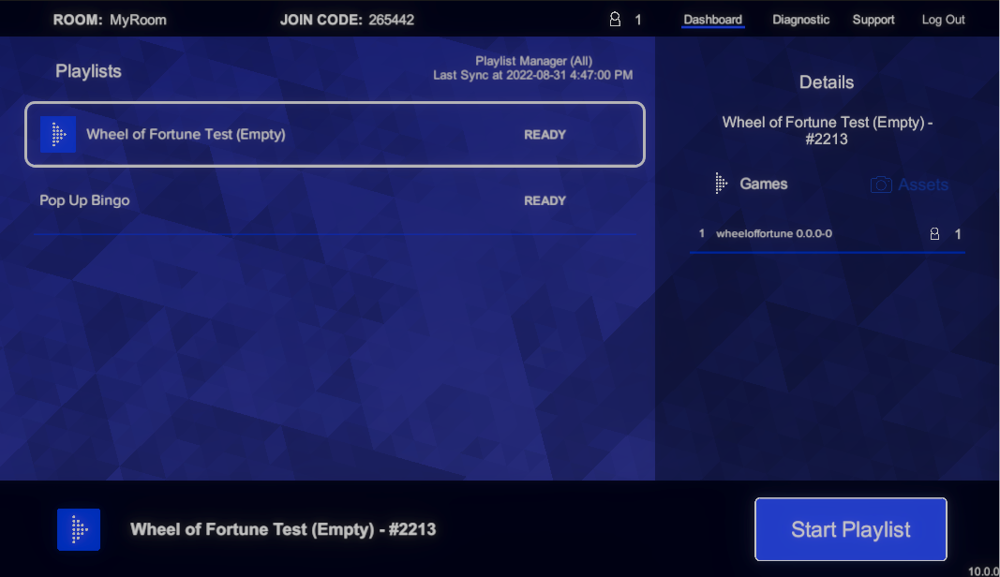

The first game should now be loaded. You can examine it in the scene Hierachy.

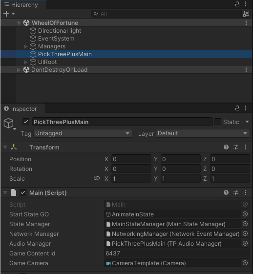

Controller should also be loaded on player's browser as well.

------------
## End of session

While the playlist is running, you can hard stop the playlist by pressing Ctrl+Q.

When a playlist finish, either run to end or stop by user, the session ends. This stops the RMB tasks assigned to this session. The player is return to the login screen.

The session still exist in opcon and the host needs to explicitly end the session here for reporting purpose. This is also necessary in the case where bigscreen or actor crash and host has to restart the same session. In this scenario, the session has not end for the players so they do not need to go through login and purchase again to join the restarted session.

If gameserver is in dashboard mode, end of playlist will return to dashboard. A new session will be created (new session ID and new RMB tasks). It's not entirely useful to use this session as opcon and player are not aware of it. It's best to create a new session from opcon.

------------
## Clean up

There are case when GameServer is not able to end session properly, such as exiting play mode while it's creating a room. This leads to RMB tasks not being clean up. You can see this in Docker Desktop if there are tasks running when gameserver is not running.

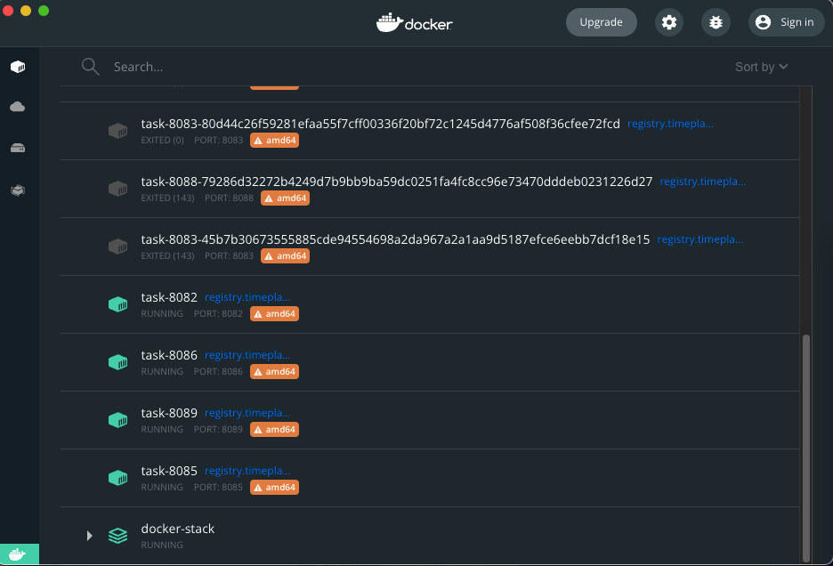

You should stop these tasks manually. The stack is configured to run up to 10 tasks (from port 8080 to 8089). If there are too many left over tasks running, gameserver will not be able to create a new room.

Stopped tasks are rename with their container ID to avoid name conflict and left in the system. This is so that developers can examine the logs later. You can clean up stopped containers by running this in terminal:

```
docker system prune
```

------------
#### This completes the testing guide for running end-to-end on your local environment.
