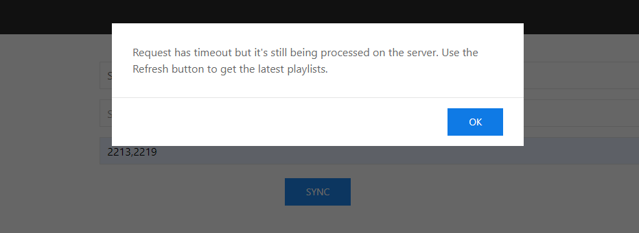
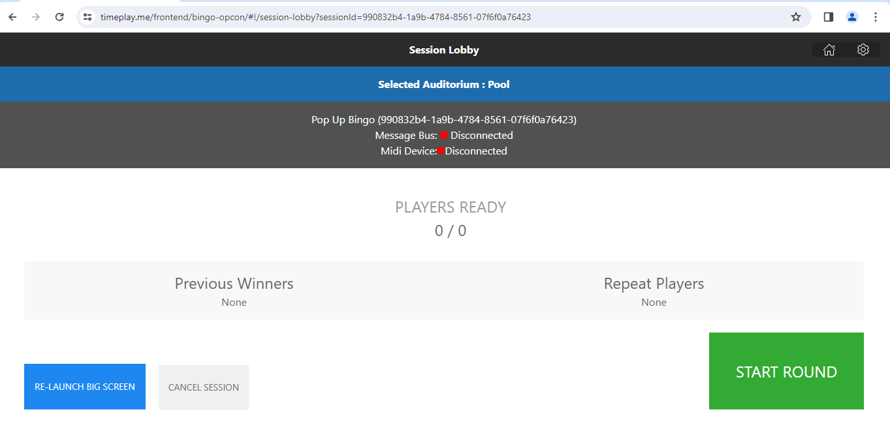
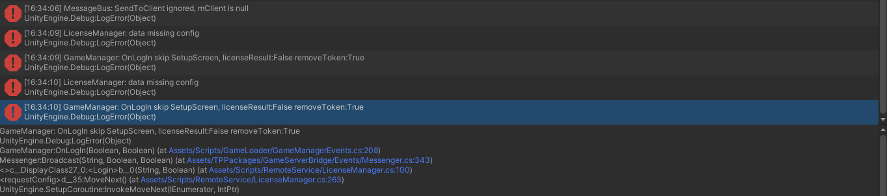

# Potential Setup Issues  

------------  
This guide meant to document/record potential issues that may occuring during the setup of the docker stack on the local environment. This document will be continually updated as more issues arise.  

## Timeplay.me refused to connect  

This issue can occur when the host IP is not added properly or the wrong IP is being used. To check whether the the right IP is being used, run the command `ipconfig` on the terminal. If using WSL you can run `ip addr show eth0`. Make sure that the `overrides.env` and `/etc/hosts` files both contain the correct address  

## Login Issues with Playlist Manager and or OpCon

Use the login credentials username: `admin` and password: `admin`. If this still doesn't work check that the `timeplay.crt` and `timeplay.key` are added to the folder under `tp3-docker-stack/container-config/cert`. Ask devops for the certificate and key if you do not already have them.  

## Issues with syncing playlists

An issue can occur when trying to sync playlists in staging1/2 where the playlist will not sync. You may also get alert shown below  
  

no solution at the moment.  

## Issues related to the OpCon

If you have successfully synced a playlist to the local stack an wish to create a session, a potential issue related to the message bus not connecting can occur.  
  

check the logs for the task-spawner using `docker logs task-spawner` to see if RMBs are being created...

no solution at the moment.

## Issue related to the Gameserver  

There are some issue that may occur when loading a playlist for the first time. When prompted to enter the license key you may get an errors such as these 
  
Be sure that your `gameserver.config3.json` is configured appropriately....  

no solution at the moment. 

